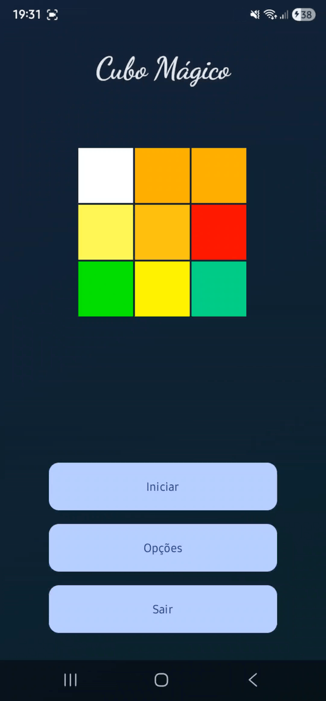
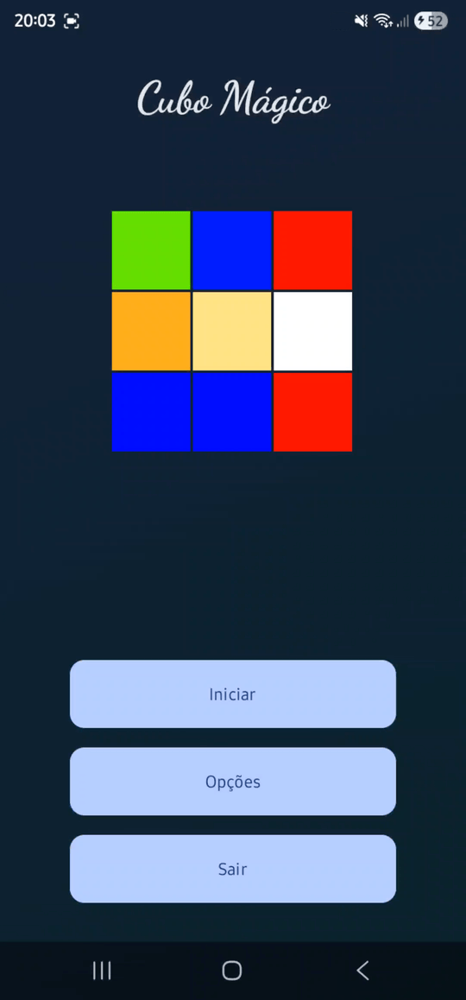

# Magic Cube Android

An interactive 3D Rubik's Cube simulator for Android, built with modern Android architecture and OpenGL ES 3.0 for real-time 3D rendering.

## Demo

|  |  |

> Rotate the cube freely with drag gestures. Swipe to rotate individual face slices. Shuffle and solve at your own pace.

---

## Features

- **3D Rendering** via OpenGL ES 3.0 with MVP matrix transformations
- **Touch interaction**: drag to rotate the cube freely, swipe to rotate a face slice
- **Inertia physics**: smooth momentum-based rotation that decays naturally
- **Closest-face detection**: swipe automatically targets the face nearest to the screen
- **Shuffle**: configurable number of random rotations (10–100 moves)
- **Settings**: tune shuffle count, rotation speed, and cube size
- **Animations**: animated gradient backgrounds on menu screens
- **Multilingual**: English, Portuguese (Brazil), and Spanish

---

## Architecture

The project follows **MVVM** with a **Clean Architecture** approach, organized into well-defined layers:

```
app/
├── activity/        # Android Activities (entry points)
├── compose/         # Jetpack Compose UI screens
├── presentation/    # ViewModels — UI state and business rules
├── domain/          # Domain models (CubeSettings)
├── data/            # Repository — settings persistence
├── grafic/          # OpenGL engine and 3D cube logic
└── di/              # Koin dependency injection module
```

### Layers

| Layer | Responsibility |
|---|---|
| **Presentation** | ViewModels expose `StateFlow` to UI; handle touch input and navigation events |
| **Domain** | Pure Kotlin data model (`CubeSettings`) with no Android dependencies |
| **Data** | `SettingsRepository` persists and emits settings as `StateFlow` |
| **Graphics** | `CubeGameEngine` drives cube logic; `CubeRenderer` handles all OpenGL calls |

### State Management

The app uses a **MVI-like** flow with `StateFlow` and `SharedFlow`:

- UI collects immutable state snapshots from ViewModels
- User actions are dispatched as events (functions on the ViewModel)
- ViewModels emit one-shot navigation events via `SharedFlow` to avoid re-delivery on recomposition

---

## Tech Stack

| Technology | Usage |
|---|---|
| **Kotlin** | 100% Kotlin codebase |
| **Jetpack Compose** | Menu and settings screens with Material Design 3 |
| **OpenGL ES 3.0** | 3D cube rendering via `GLSurfaceView` |
| **MVVM + Clean Architecture** | Separation of concerns across presentation, domain, and data layers |
| **Koin 4** | Dependency injection for ViewModels and repositories |
| **Kotlin Coroutines & Flow** | Reactive state management with `StateFlow` and `SharedFlow` |
| **Version Catalog** | Centralized dependency versioning via `libs.versions.toml` |
| **GitHub Actions** | CI pipeline with unit tests |

---

## 3D Rendering

The rendering engine is built directly on **OpenGL ES 3.0**, without any third-party 3D framework.

### Pipeline

1. A `GLSurfaceView` hosts a custom `CubeRenderer` that implements `GLSurfaceView.Renderer`
2. Each frame, the renderer clears buffers, sets up a frustum projection, and applies the current rotation state
3. The 27 cube pieces are rendered in a nested loop, each translated to its grid position and colored with its face data
4. Back-face culling and depth testing are enabled for correctness and performance

### Shaders

Custom GLSL vertex and fragment shaders are used:

- **Vertex shader**: transforms each vertex through the MVP matrix
- **Fragment shader**: applies flat shading (per-face solid color, no lighting model)

### Matrix Transformations

A `MatrixTracker` wrapper manages the 4×4 transformation stack using Android's `Matrix` class, supporting push/pop for nested transformations. Rotations are applied around each piece's center via a center-translate → rotate → inverse-translate sequence.

---

## Cube Logic

### Data Structure

- `cubeList`: 27 `Cube` objects representing all pieces (8 corners, 12 edges, 6 face centers, 1 core)
- `pos[x][z][y]`: 3D index mapping grid coordinates to cube piece indices

### Rotation Algorithm

Each of the 12 possible slice rotations (3 axes × 2 directions × 3 slices for some axes) is represented by a `rot` index and a `sense` (-1 or 1). When the user swipes:

1. The animation angle increments by 9° per frame until it reaches 90°
2. After completing 90°, the `save()` method cycles the 8 surrounding pieces through their new positions and updates color assignments via `saveRot()`

### Closest-Face Detection

During rendering, the Z-depth of each face center is tracked. When a swipe is detected, the face with the smallest Z value (closest to the screen) determines which slice to rotate, making the interaction feel natural regardless of cube orientation.

### Shuffle

The shuffle algorithm fires `numEmbaralhar = 10 × shuffleCount` (between 10 and 100) random rotations in sequence, using a random `rot` value for each step.

---

## Touch Interaction

Touch events are processed in `MagicCubeActivity` and forwarded to `CubeViewModel`:

| Gesture | Threshold | Action |
|---|---|---|
| **Drag** | Movement slower than 250 ms | Freely rotates the entire cube |
| **Swipe** | Fast movement > 100 px in < 250 ms | Rotates the closest face slice |

Drag rotation scales proportionally to the configured speed setting. Swipe triggers closest-face detection for slice targeting.

---

## Dependency Injection

Koin is configured in a single `AppModule`:

```kotlin
val appModule = module {
    singleOf(::SettingsRepository)
    viewModelOf(::MainMenuViewModel)
    viewModelOf(::CubeViewModel)
    viewModelOf(::OptionsViewModel)
}
```

ViewModels are injected in activities with `viewModel()` and in Compose screens with `koinViewModel()`.

---

## Project Setup

**Requirements:**
- Android Studio Hedgehog or later
- Min SDK 21 / Target SDK 35

**Clone and run:**

```bash
git clone https://github.com/gugabrilhante/MagicCube-Android.git
```

Open in Android Studio and run on a physical device or emulator with OpenGL ES 3.0 support.

---

## License

This project is open source. See [LICENSE](LICENSE) for details.
